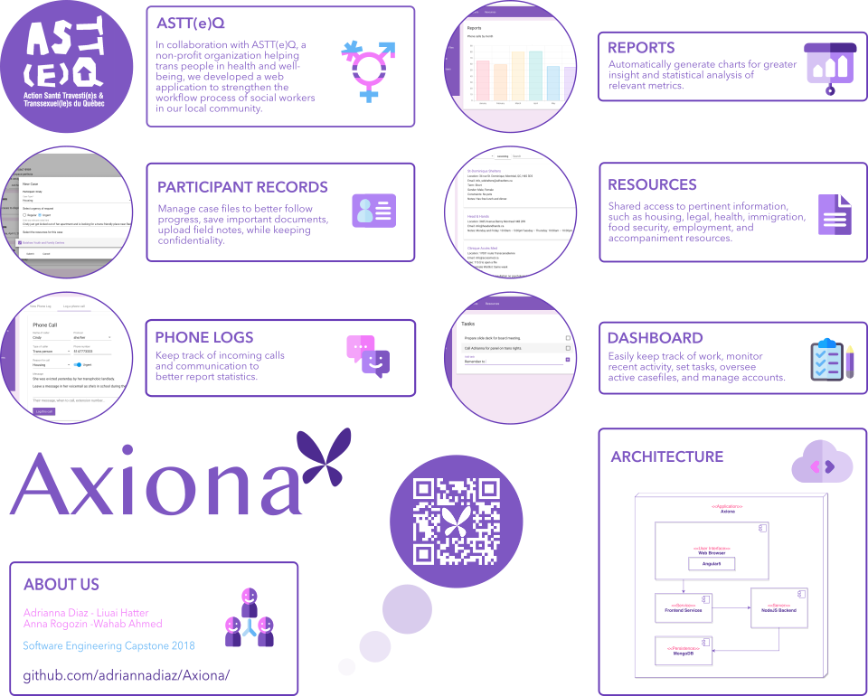
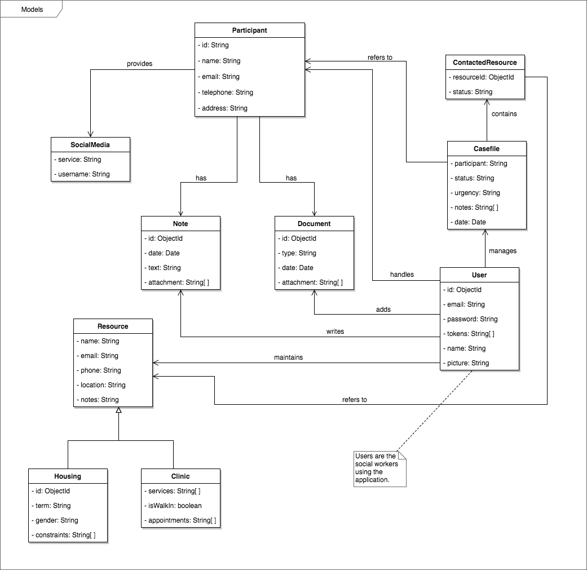

 

Axiona
============

A free, open-source application to strengthen the workflow process of social workers in our local community.

Capabilities:
-------------
- Handle casefiles
- Log phonecalls
- Manage participants' records

Developed by:
-------------
- Adrianna Diaz
- Anna Rogozin
- Liuai Hatter
- Wahab Ahmed

Domain Model:
-------------

Installation:
-------------

1. Make sure you have Docker installed.
2. Run the command `docker-compose up` to start the containers
3. To stop use the command `docker-compose down` (possibly from another terminal window, as sometimes the originating one can get blocked.
